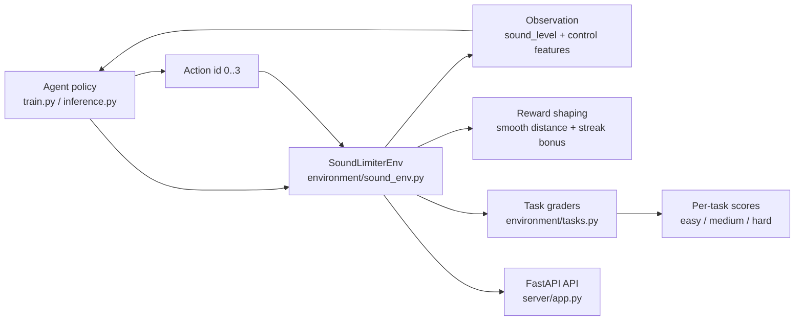

# Sound Limiter RL Environment

An OpenEnv-compatible reinforcement learning environment where an agent manages meeting-room sound levels and keeps dB in a safe range.

## Project layout

- `server/app.py`: FastAPI server with OpenEnv endpoints.
- `server.py`: compatibility launcher for local runs.
- `environment/sound_env.py`: core environment dynamics.
- `environment/tasks.py`: task definitions and graders.
- `train.py`: baseline training (PyTorch DQN by default, Q-learning fallback).
- `inference.py`: submission-time inference script.
- `scripts/validate-submission.sh`: Bash validator.
- `scripts/validate-submission.ps1`: PowerShell validator.

## Design rationale

- Safe zone is 40-70 dB because it balances speech intelligibility and listener comfort in small/medium meeting rooms.
- The four-action set (`do_nothing`, `warn`, `reduce_gain`, `mute`) gives a realistic escalation ladder from low-cost nudges to hard intervention.
- Task noise escalation (`noise_std`: 1.5 -> 4.0 -> 7.0) forces policies to generalize from calm to volatile acoustic conditions.
- Episodes end early after sustained dangerous loudness (>95 dB for 3 consecutive steps) to model safety-critical control.

## Architecture diagram



## Reward design (implemented)

- Inside the safe zone, reward is positive and includes a streak bonus for sustained control.
- Outside the safe zone, penalty grows smoothly with distance from the nearest safe boundary.
- Excess loudness is penalized more than undershoot to reflect higher practical risk.
- Reward values are clipped to `[-2.0, 1.25]` for stable training and predictable grading.

## Setup

```powershell
python -m venv venv
.\venv\Scripts\Activate.ps1
pip install -r requirements.txt
```

Create a `.env` file in the project root:

```dotenv
HF_TOKEN=your_hf_or_openai_token
OPENAI_API_KEY=your_openai_key
```

Both `inference.py` and `server/app.py` auto-load values from `.env`.

## Run API server

```powershell
python app.py
```

Or with Uvicorn:

```powershell
uvicorn server:app --host 0.0.0.0 --port 7860
```

## Train baseline agent

```powershell
python train.py
```

Default mode trains a PyTorch DQN baseline and creates `dqn_model.pt`.

Training now tracks both exploration-phase and deterministic evaluation metrics:

- Episode reward (raw + moving average)
- Training success rate (fraction of episodes that meet each sampled task threshold)
- Periodic deterministic evaluation (`epsilon=0`) across easy/medium/hard tasks
- Per-task score trend over time

Artifacts written after training:

- `training_progress.png`: reward + success/score learning curves
- `training_metrics.json`: full metric history for analysis

To force tabular Q-learning:

```powershell
$env:BASELINE_ALGO = "q_table"
python train.py
```

Useful overrides:

```powershell
$env:TRAIN_EPISODES = "1200"
$env:RENDER_EVERY = "100"
$env:EVAL_EVERY = "100"
$env:EVAL_EPISODES = "8"
$env:TRAIN_SEED = "42"
python train.py
```

## Run inference

Set required variables for LLM mode:

```powershell
$env:API_BASE_URL = "https://api.openai.com/v1"
$env:MODEL_NAME = "gpt-4o-mini"
$env:HF_TOKEN = "<your-token>"
python inference.py
```

If those variables are in `.env`, you can run `python inference.py` directly.

Heuristic-only mode (no HF token required):

```powershell
$env:HEURISTIC_ONLY = "1"
python inference.py
```

## Validate submission

### PowerShell (Windows)

```powershell
.\scripts\validate-submission.ps1 https://your-space.hf.space
```

### Bash (WSL/Git Bash/macOS/Linux)

```bash
./scripts/validate-submission.sh https://your-space.hf.space
```

## Testing

Run pytest suite:

```powershell
pip install pytest
pytest
```

Run legacy smoke script:

```powershell
python test_env.py
```

## OpenEnv checks

```powershell
openenv validate
```

If `openenv --version` fails, use:

```powershell
openenv --help
```

## Real-time and extensibility endpoints

- `POST /tasks`: register or overwrite a custom task config at runtime.
- `POST /tasks/register`: register a custom task (conflict-safe alias endpoint).
- `GET /tasks`: list all registered tasks (default + custom).
- `GET /tasks/{task_id}`: inspect one task.
- `POST /tasks/{task_id}/grade`: run grader for a given task.
- `WS /ws`: low-overhead streaming endpoint for `reset`, `step`, and `state` messages.

## Security and rate limiting

Optional environment variables:

- `API_AUTH_TOKEN`: require matching `X-API-Key` header for all API requests.
- `RATE_LIMIT_PER_MINUTE`: per-client request limit (0 disables rate limiting).
- `CORS_ALLOW_ORIGINS`: comma-separated allowed origins.
- `CORS_ALLOW_METHODS`: comma-separated allowed HTTP methods.
- `CORS_ALLOW_HEADERS`: comma-separated allowed request headers.

## CI

GitHub Actions workflow in `.github/workflows/ci.yml` runs:

1. `pytest`
2. `openenv validate`
